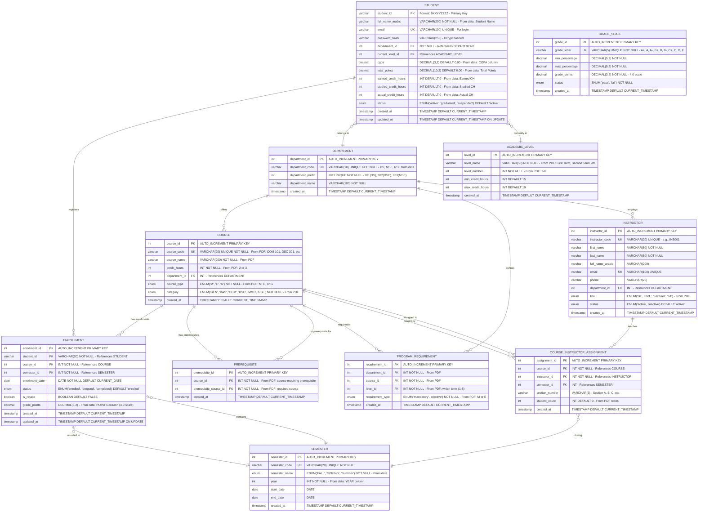

# Student Registration System - Database ERD

## Entity Relationship Diagram



## Key Design Decisions

### 1. **Student ID Structure (From Row-Data)**
**Format: `9XXYYZZZZ`**
- **9**: Fixed prefix for all students
- **XX**: Department code (31=DS, 32=RSE, 33=MSE)
- **YY**: Enrollment year (23=2023)
- **ZZZZ**: Sequential student number (0001-9999)

**Examples from actual data:**
- `931230001` to `931230844`: DS students (844 total)
- `932230001` to `932230482`: RSE students (482 total)
- `933230001` to `933230307`: MSE students (307 total)

### 2. **Database Structure**

**Data-Driven Tables (from row-data files):**
- **STUDENT**: From CGPA Excel files (student_id, name, cgpa, credit hours)
- **ENROLLMENT**: From Grades Excel files (student enrollments, marks, grades, points)
- **COURSE**: From 4-level plan PDFs (codes, names, credit hours)
- **SEMESTER**: From Grades Excel (YEAR, SEMESTER columns)
- **PREREQUISITE**: From PDFs (course dependencies)
- **PROGRAM_REQUIREMENT**: From PDFs (curriculum by term)

**Operational Tables (for system functionality):**
- **INSTRUCTOR**: Faculty information (names mentioned in PDFs - Dr. Soha, Dr. Roaa, etc.)
- **COURSE_INSTRUCTOR_ASSIGNMENT**: Maps instructors to courses and sections

### 3. **Three Departments (From Data)**
- **DS** (Data Science): 844 students, prefix 931
- **MSE** (Multimedia & Software Engineering): 307 students, prefix 933
- **RSE** (Robotics & Software Engineering): 482 students, prefix 932

**Program Structure (From PDFs):**
- Total: 138 credit hours
  - GEN (General): 12 CH
  - BAS (Basic Sciences): 24 CH
  - COM (Common/Faculty): 39 CH
  - DSC/MMD/RSE (Specialization): 57 CH
  - Graduation Project: 6 CH

**Enrollment Limits Based on CGPA:**
- CGPA 0.00 - 1.00: Maximum 3 courses per semester
- CGPA 1.00 - 2.00: Maximum 5 courses per semester
- CGPA 2.00 - 3.00: Maximum 6 courses per semester
- CGPA 3.00 - 4.00: Maximum 7 courses per semester

### 4. **Course Data (From PDFs)**

**Categories:**
- `GEN`: University requirements (English, Ethics)
- `BAS`: Basic sciences (Math, Physics, Statistics)
- `COM`: Faculty requirements (Programming, Database, Networks)
- `DSC`: Data Science specialization
- `MMD`: Multimedia specialization
- `RSE`: Robotics specialization

**Types:**
- `M` (Mandatory): Required courses
- `E` (Elective): Student choice
- `G` (Graduation): Final projects and training

**Examples from PDFs:**
- GEN 101 (English I) - 2 CH, M
- BAS 101 (Mathematics) - 3 CH, M
- COM 101 (Introduction to Computers) - 3 CH, M
- DSC 301 (Advanced Database) - 3 CH, M
- COM 210 (Advanced Programming) - 3 CH, E

### 5. **Academic Records (From Excel)**

**Columns in Subjects Grades files:**
- STUDENT_ID: e.g., 931230001
- STUDENT_NAME: Arabic name
- YEAR: e.g., 2023
- SEMESTER: FALL, SPRING, or Summer
- COURSE_TITLE: e.g., "BAS 101-Mathematics"
- MARKS: Raw score (0-100)
- GRADE_PERCENT: Percentage (0-100)
- GRADE_LETTER: A+, A, B+, C, F, etc.
- POINTS: Grade points (4.0 scale)
- CREDIT_HOURS: Course credits
- ACT_CREDIT_HOURS: Earned credits (0 if failed)
- COMMENT: Optional notes

**Real Data Example:**
```
Student 931230001:
BAS 101-Mathematics: MARKS=71.0, GRADE=C, POINTS=2.4, CH=3, ACT_CH=3
BAS 102-Discrete Math: MARKS=40.0, GRADE=F, POINTS=0.0, CH=3, ACT_CH=0
```

### 6. **CGPA Calculation (From Excel)**
Data files show these summary fields:
```
CGPA = Total Points / Studied CH
Example: Student 931230001
- CGPA: 2.34
- Total Points: 117.0
- Actual CH: 50 (passed courses)
- Earned CH: 50
- Studied CH: 52 (all attempted)
```

### 7. **Prerequisites (From PDFs)**
Real prerequisite chains:
```
COM 103 (Programming) ← COM 101 (Intro to Computers)
COM 202 (Algorithms) ← COM 103 (Programming)
COM 207 (Data Structures) ← COM 202 (Algorithms)
DSC 301 (Advanced Database) ← COM 203 (Database System)
DSC 304 (Practical Data Mining) ← DSC 301 (Advanced Database)
```

### 8. **Semester Data (From Excel)**
Grades files contain:
- YEAR: 2023, 2024
- SEMESTER: FALL, SPRING, Summer

Semesters are created from YEAR + SEMESTER combination.

### 9. **Data Integrity**

**Primary Keys:**
- STUDENT.student_id: VARCHAR (e.g., 931230001)
- Other tables: AUTO_INCREMENT INT

**Unique Constraints:**
- STUDENT.student_id (from data)
- DEPARTMENT.department_code (DS, MSE, RSE)
- DEPARTMENT.department_prefix (931, 932, 933)
- COURSE.course_code (from PDFs)
- SEMESTER.semester_code (YEAR-SEASON)
- GRADE_SCALE.grade_letter

**Check Constraints:**
```sql
-- CGPA must be 0-4
ALTER TABLE STUDENT ADD CONSTRAINT chk_cgpa
  CHECK (cgpa >= 0.00 AND cgpa <= 4.00);

-- Grade points 0-4.0
ALTER TABLE ENROLLMENT ADD CONSTRAINT chk_grade_points
  CHECK (grade_points >= 0.00 AND grade_points <= 4.00);

-- Credit hours positive
ALTER TABLE COURSE ADD CONSTRAINT chk_credits
  CHECK (credit_hours > 0);
```

**Business Rules (Application-Level Validation):**
```sql
-- Enrollment limit based on CGPA (implement as trigger or application logic)
-- CGPA 0.00-1.00: Max 3 courses per semester
-- CGPA 1.00-2.00: Max 5 courses per semester
-- CGPA 2.00-3.00: Max 6 courses per semester
-- CGPA 3.00-4.00: Max 7 courses per semester

DELIMITER $$
CREATE TRIGGER trg_check_enrollment_limit
BEFORE INSERT ON ENROLLMENT
FOR EACH ROW
BEGIN
  DECLARE student_cgpa DECIMAL(3,2);
  DECLARE current_count INT;
  DECLARE max_allowed INT;

  -- Get student CGPA
  SELECT cgpa INTO student_cgpa
  FROM STUDENT
  WHERE student_id = NEW.student_id;

  -- Determine max courses based on CGPA
  SET max_allowed = CASE
    WHEN student_cgpa >= 0.00 AND student_cgpa < 1.00 THEN 3
    WHEN student_cgpa >= 1.00 AND student_cgpa < 2.00 THEN 5
    WHEN student_cgpa >= 2.00 AND student_cgpa < 3.00 THEN 6
    WHEN student_cgpa >= 3.00 AND student_cgpa <= 4.00 THEN 7
    ELSE 3
  END;

  -- Count current enrollments for the semester
  SELECT COUNT(*) INTO current_count
  FROM ENROLLMENT
  WHERE student_id = NEW.student_id
    AND semester_id = NEW.semester_id
    AND status = 'enrolled';

  -- Check if limit exceeded
  IF current_count >= max_allowed THEN
    SIGNAL SQLSTATE '45000'
    SET MESSAGE_TEXT = 'Enrollment limit exceeded based on CGPA';
  END IF;
END$$
DELIMITER ;
```

## Database Indexes (Recommendations)

```sql
-- STUDENT TABLE
CREATE UNIQUE INDEX idx_student_email ON STUDENT(email);
CREATE INDEX idx_student_department ON STUDENT(department_id);
CREATE INDEX idx_student_cgpa ON STUDENT(cgpa DESC);

-- COURSE TABLE
CREATE UNIQUE INDEX idx_course_code ON COURSE(course_code);
CREATE INDEX idx_course_category ON COURSE(category);
CREATE INDEX idx_course_type ON COURSE(course_type);

-- INSTRUCTOR TABLE
CREATE UNIQUE INDEX idx_instructor_email ON INSTRUCTOR(email);
CREATE INDEX idx_instructor_department ON INSTRUCTOR(department_id);
CREATE INDEX idx_instructor_status ON INSTRUCTOR(status);

-- ENROLLMENT TABLE
CREATE INDEX idx_enrollment_student ON ENROLLMENT(student_id);
CREATE INDEX idx_enrollment_course ON ENROLLMENT(course_id);
CREATE INDEX idx_enrollment_semester ON ENROLLMENT(semester_id);
CREATE INDEX idx_enrollment_status ON ENROLLMENT(status);
CREATE INDEX idx_enrollment_student_semester ON ENROLLMENT(student_id, semester_id);
CREATE UNIQUE INDEX idx_enrollment_unique ON ENROLLMENT(student_id, course_id, semester_id);

-- COURSE_INSTRUCTOR_ASSIGNMENT TABLE
CREATE INDEX idx_assignment_course ON COURSE_INSTRUCTOR_ASSIGNMENT(course_id);
CREATE INDEX idx_assignment_instructor ON COURSE_INSTRUCTOR_ASSIGNMENT(instructor_id);
CREATE INDEX idx_assignment_semester ON COURSE_INSTRUCTOR_ASSIGNMENT(semester_id);

-- PREREQUISITE TABLE
CREATE INDEX idx_prereq_course ON PREREQUISITE(course_id);
CREATE INDEX idx_prereq_required ON PREREQUISITE(prerequisite_course_id);
CREATE UNIQUE INDEX idx_prereq_unique ON PREREQUISITE(course_id, prerequisite_course_id);

-- SEMESTER TABLE
CREATE UNIQUE INDEX idx_semester_code ON SEMESTER(semester_code);
CREATE INDEX idx_semester_year ON SEMESTER(year);

-- PROGRAM_REQUIREMENT TABLE
CREATE INDEX idx_requirement_dept_level ON PROGRAM_REQUIREMENT(department_id, level_id);
CREATE INDEX idx_requirement_course ON PROGRAM_REQUIREMENT(course_id);

-- GRADE_SCALE TABLE
CREATE UNIQUE INDEX idx_grade_letter ON GRADE_SCALE(grade_letter);
```

## Sample Queries

### 1. **Student Profile**
```sql
-- Get student information with department and level
SELECT
  s.student_id,
  s.full_name_arabic,
  s.email,
  s.cgpa,
  s.total_points,
  s.earned_credit_hours,
  s.studied_credit_hours,
  s.actual_credit_hours,
  d.department_name,
  d.department_code,
  al.level_name,
  al.level_number,
  s.status
FROM STUDENT s
JOIN DEPARTMENT d ON s.department_id = d.department_id
LEFT JOIN ACADEMIC_LEVEL al ON s.current_level_id = al.level_id
WHERE s.student_id = ?;
```

### 2. **Calculate Student CGPA**
```sql
-- Calculate CGPA from enrollment records
SELECT
  e.student_id,
  ROUND(SUM(e.grade_points * c.credit_hours) / NULLIF(SUM(c.credit_hours), 0), 2) as cgpa,
  SUM(e.grade_points * c.credit_hours) as total_points,
  SUM(c.credit_hours) as earned_credits,
  SUM(c.credit_hours) as studied_credits
FROM ENROLLMENT e
JOIN COURSE c ON e.course_id = c.course_id
WHERE e.student_id = ? AND e.status = 'completed' AND e.grade_points IS NOT NULL
GROUP BY e.student_id;

-- Update student CGPA
UPDATE STUDENT
SET
  cgpa = ?,
  total_points = ?,
  earned_credit_hours = ?,
  studied_credit_hours = ?,
  updated_at = CURRENT_TIMESTAMP
WHERE student_id = ?;
```

### 3. **Get Student Transcript**
```sql
-- Complete academic history
SELECT
  sem.year,
  sem.semester_name,
  c.course_code,
  c.course_name,
  c.credit_hours,
  e.grade_points
FROM ENROLLMENT e
JOIN SEMESTER sem ON e.semester_id = sem.semester_id
JOIN COURSE c ON e.course_id = c.course_id
WHERE e.student_id = ? AND e.status = 'completed'
ORDER BY sem.year, sem.semester_name, c.course_code;
```

### 4. **Get Courses by Department and Level**
```sql
-- Get curriculum for specific department and term
SELECT
  al.level_name,
  pr.requirement_type,
  c.course_code,
  c.course_name,
  c.course_type,
  c.category,
  c.credit_hours,
  c.instructor_notes
FROM PROGRAM_REQUIREMENT pr
JOIN COURSE c ON pr.course_id = c.course_id
JOIN ACADEMIC_LEVEL al ON pr.level_id = al.level_id
WHERE pr.department_id = ?
  AND al.level_number = ?
ORDER BY pr.requirement_type, c.course_code;
```

### 5. **Check Prerequisites for Course**
```sql
-- Get prerequisites for a course
SELECT
  c.course_code,
  c.course_name,
  pc.course_code as prereq_course_code,
  pc.course_name as prereq_course_name
FROM COURSE c
JOIN PREREQUISITE p ON c.course_id = p.course_id
JOIN COURSE pc ON p.prerequisite_course_id = pc.course_id
WHERE c.course_id = ?
ORDER BY pc.course_code;
```

### 6. **Check Graduation Eligibility**
```sql
-- Verify graduation requirements (138 total credit hours from PDFs)
SELECT
  s.student_id,
  s.full_name_arabic,
  s.earned_credit_hours,
  138 as required_credit_hours,
  s.cgpa,
  138 - s.earned_credit_hours as credits_remaining,
  -- Overall eligibility
  CASE
    WHEN s.earned_credit_hours >= 138
      AND s.cgpa >= 2.00
    THEN 'ELIGIBLE'
    ELSE 'NOT_ELIGIBLE'
  END as graduation_status
FROM STUDENT s
WHERE s.student_id = ?;
```

### 7. **Students by Department**
```sql
-- List all students in a department
SELECT
  s.student_id,
  s.full_name_arabic,
  s.cgpa,
  s.earned_credit_hours,
  s.status,
  al.level_name
FROM STUDENT s
LEFT JOIN ACADEMIC_LEVEL al ON s.current_level_id = al.level_id
WHERE s.department_id = ?
ORDER BY s.student_id;
```

### 8. **Course Grade Statistics**
```sql
-- Get grade statistics for a course
SELECT
  c.course_code,
  c.course_name,
  sem.year,
  sem.semester_name,
  COUNT(*) as total_students,
  ROUND(AVG(e.grade_points), 2) as avg_grade_points,
  ROUND(MIN(e.grade_points), 2) as min_grade_points,
  ROUND(MAX(e.grade_points), 2) as max_grade_points
FROM ENROLLMENT e
JOIN COURSE c ON e.course_id = c.course_id
JOIN SEMESTER sem ON e.semester_id = sem.semester_id
WHERE c.course_id = ?
  AND sem.semester_id = ?
  AND e.status = 'completed'
  AND e.grade_points IS NOT NULL
GROUP BY c.course_code, c.course_name, sem.year, sem.semester_name;
```

### 9. **Student Course Registration**
```sql
-- Check enrollment eligibility based on CGPA limits
SELECT
  s.student_id,
  s.cgpa,
  COUNT(e.enrollment_id) as current_enrollments,
  CASE
    WHEN s.cgpa >= 0.00 AND s.cgpa < 1.00 THEN 3
    WHEN s.cgpa >= 1.00 AND s.cgpa < 2.00 THEN 5
    WHEN s.cgpa >= 2.00 AND s.cgpa < 3.00 THEN 6
    WHEN s.cgpa >= 3.00 AND s.cgpa <= 4.00 THEN 7
    ELSE 3
  END as max_courses,
  CASE
    WHEN COUNT(e.enrollment_id) < CASE
      WHEN s.cgpa >= 0.00 AND s.cgpa < 1.00 THEN 3
      WHEN s.cgpa >= 1.00 AND s.cgpa < 2.00 THEN 5
      WHEN s.cgpa >= 2.00 AND s.cgpa < 3.00 THEN 6
      WHEN s.cgpa >= 3.00 AND s.cgpa <= 4.00 THEN 7
      ELSE 3
    END THEN 'CAN_ENROLL'
    ELSE 'LIMIT_REACHED'
  END as enrollment_status
FROM STUDENT s
LEFT JOIN ENROLLMENT e ON s.student_id = e.student_id
  AND e.semester_id = ?
  AND e.status = 'enrolled'
WHERE s.student_id = ?
GROUP BY s.student_id, s.cgpa;

-- Register student for a course (after checking eligibility)
INSERT INTO ENROLLMENT (student_id, course_id, semester_id, enrollment_date, status)
VALUES (?, ?, ?, CURRENT_DATE, 'enrolled');

-- Get enrollment_id for linking
SELECT LAST_INSERT_ID() as enrollment_id;
```

### 10. **Get Student Enrollments**
```sql
-- List all enrollments for a student in a semester
SELECT
  e.enrollment_id,
  c.course_code,
  c.course_name,
  c.credit_hours,
  e.enrollment_date,
  e.status,
  e.is_retake,
  e.grade_points
FROM ENROLLMENT e
JOIN COURSE c ON e.course_id = c.course_id
WHERE e.student_id = ?
  AND e.semester_id = ?
ORDER BY c.course_code;
```

### 11. **Get Instructor Course Assignments**
```sql
-- List all courses taught by an instructor
SELECT
  c.course_code,
  c.course_name,
  sem.year,
  sem.semester_name,
  cia.section_number,
  cia.student_count
FROM COURSE_INSTRUCTOR_ASSIGNMENT cia
JOIN COURSE c ON cia.course_id = c.course_id
JOIN SEMESTER sem ON cia.semester_id = sem.semester_id
WHERE cia.instructor_id = ?
ORDER BY sem.year DESC, sem.semester_name, c.course_code;
```

### 12. **Get Instructors by Department**
```sql
-- List all instructors in a department
SELECT
  i.instructor_id,
  i.first_name,
  i.last_name,
  i.title,
  i.email,
  i.status,
  d.department_name
FROM INSTRUCTOR i
JOIN DEPARTMENT d ON i.department_id = d.department_id
WHERE i.department_id = ?
ORDER BY i.last_name, i.first_name;
```

### 13. **Get Course Roster (Instructor View)**
```sql
-- Get all students enrolled in a course
SELECT
  s.student_id,
  s.full_name_arabic,
  s.cgpa,
  d.department_code,
  e.enrollment_date,
  e.is_retake,
  e.grade_points
FROM ENROLLMENT e
JOIN STUDENT s ON e.student_id = s.student_id
JOIN DEPARTMENT d ON s.department_id = d.department_id
WHERE e.course_id = ?
  AND e.semester_id = ?
  AND e.status = 'enrolled'
ORDER BY s.student_id;
```

## Real Data Summary (from row-data/)

### Student Population
Based on the actual Excel data files:

| Department | Code | Student ID Prefix | Total Students | Data File |
|------------|------|-------------------|----------------|-----------|
| Data Science | DS | 931 | 844 | Students CGPA_DS.xlsx |
| Robotics & SE | RSE | 932 | 482 | Students CGPA_RSE.xlsx |
| Multimedia & SE | MSE | 933 | 307 | Students CGPA_MSE.xlsx |
| **Total** | - | - | **1,633** | - |

### Academic Records Statistics
From `Subjects Grades_DS.xlsx`:
- **Total grade records**: 15,176 records for DS students only
- **Data structure matches ERD**: ✅ All fields present in data
- **Includes**: Student ID, Name, Year, Semester (SPRING/FALL/Summer), Course Title, Marks, Grades, Points, Credit Hours, Comments

### Course Data (from 4-level plan PDFs)
**DS Program (Data Science):**
- Total Terms: 8 (4 years)
- Total Credit Hours: 138
  - University Requirements (GEN): 12 CH
  - Basic Sciences (BAS): 24 CH
  - Faculty Requirements (COM): 39 CH
  - Specialization (DSC): 57 CH
  - Graduation Project: 6 CH

**Sample Courses from Real Data:**
```
Term 1:
- GEN 101 (English I) - 2 CH, M
- GEN 103 (Social issues and anti-corruption) - 2 CH, M
- BAS 101 (Mathematics) - 3 CH, M
- BAS 102 (Discrete Mathematics) - 3 CH, M
- BAS 104 (Statistics and Probabilities) - 3 CH, M
- COM 101 (Introduction to Computers) - 3 CH, M
- COM 102 (Fundamentals of Information Systems) - 3 CH, M
Total: 19 CH

Term 2:
- GEN 102 (English II) - 2 CH, M → Prerequisite: English I
- COM 104 (Logic Design) - 3 CH, M → Prerequisite: Discrete Mathematics
- COM 103 (Programming) - 3 CH, M → Prerequisite: Introduction to Computers
- BAS 103 (Physics) - 3 CH, M
- GEN 115 (Professional Ethics) - 2 CH, E
- GEN 113 (Creative Thinking) - 2 CH, E
- BAS 203 (Fundamentals of Management) - 3 CH, E
Total: 18 CH
```

### Instructor Assignments (from PDFs)
Real examples showing multiple instructors per course:
- **COM 103 (Programming)**: Dr. Soha (4 sections), Milad (2 sections)
- **GEN 102 (English II)**: Dr. Sarah Yahia, Dr. Amira, Dr. Sarah Naiem
- **COM 104 (Logic Design)**: Dr. Roaa (7 sections)
- **BAS 103 (Physics)**: Dr. Ayat (7 sections)
- **GEN 115 (Professional Ethics)**: Dr. Osama (5 sections), Ahmed Hisham (1 section)
- **GEN 113 (Creative Thinking)**: Dr. Helal (3 sections), Dr. Safaa (4 sections)

### Grade Distribution Example (Student 931230001)
Real data from `Subjects Grades_DS.xlsx`:
```
BAS 101-Mathematics:
  MARKS: 71.0 → GRADE: C → POINTS: 2.4 → STATUS: pass

BAS 102-Discrete Mathematics:
  MARKS: 40.0 → GRADE: F → POINTS: 0.0 → STATUS: fail
  (Student likely retook this course)
```

### Data Validation Insights

**Student ID Format Confirmed:**
- DS students: `931230001` to `931230844`
- RSE students: `932230001` to `932230482`
- MSE students: `933230001` to `933230307`
- Format: `9[DEPT][YEAR][SEQUENCE]` where DEPT=31/32/33, YEAR=23

**Semester Naming Confirmed:**
- Uses: `SPRING`, `FALL`, `Summer` (not "First Term", "Second Term")
- Year field separate from semester name
- Example: 2023-SPRING, 2024-FALL

**Course Title Format:**
- Actual format in data: `"BAS 101-Mathematics"` (CODE-Name)
- Should be stored as `course_title` generated field

**Credit Hours Distribution:**
- Most courses: 3 credit hours
- Some courses: 2 credit hours (mainly GEN category)
- Graduation projects: 3 credit hours each (COM 400, COM 498)

**CGPA Range in Real Data:**
- Minimum: ~1.99
- Maximum: ~4.00
- Average: ~2.3-2.5 (varies by department)
- Data confirms DECIMAL(3,2) is appropriate

### Tables in ERD

**Core Tables (from data files):**
1. ✅ **STUDENT** - From Students CGPA Excel files
2. ✅ **ENROLLMENT** - From Subjects Grades Excel files (enrollments and grades)
3. ✅ **COURSE** - From 4-level plan PDFs
4. ✅ **SEMESTER** - From YEAR + SEMESTER columns in Excel
5. ✅ **DEPARTMENT** - From student ID prefixes and course categories
6. ✅ **PREREQUISITE** - From prerequisite columns in PDFs
7. ✅ **PROGRAM_REQUIREMENT** - From 4-level plan term assignments
8. ✅ **ACADEMIC_LEVEL** - From term numbers in PDFs (1-8)
9. ✅ **GRADE_SCALE** - Implied by grade letter to points mapping

**System Tables (for operations):**
10. ✅ **INSTRUCTOR** - Faculty/instructors (names mentioned in PDFs)
11. ✅ **COURSE_INSTRUCTOR_ASSIGNMENT** - Instructor-course mapping

**Key Data Points:**
- Student IDs: 931230001-931230844 (DS), 932230001-932230482 (RSE), 933230001-933230307 (MSE)
- Total Students: 1,633
- Grade Records: 15,176+ (DS only in Excel)
- Semesters: 2023-SPRING, 2023-Summer, 2024-FALL, etc.
- Courses: GEN 101, BAS 101, COM 101, DSC 301, etc.
- Instructors: Dr. Soha, Dr. Roaa, Dr. Ayat, Milad, etc. (from PDFs)

## Implementation Notes

### Database Creation Order
1. **DEPARTMENT** - Base reference table
2. **ACADEMIC_LEVEL** - Level definitions (1-8)
3. **GRADE_SCALE** - Grading system
4. **SEMESTER** - Academic calendar
5. **STUDENT** - Student records
6. **INSTRUCTOR** - Faculty records
7. **COURSE** - Course catalog
8. **PREREQUISITE** - Course dependencies
9. **PROGRAM_REQUIREMENT** - Curriculum mapping
10. **COURSE_INSTRUCTOR_ASSIGNMENT** - Instructor teaching assignments
11. **ENROLLMENT** - Student course registrations and grades

### Data Migration from Excel
When importing the existing data:

**1. Students CGPA files → STUDENT table:**
```python
import pandas as pd

df = pd.read_excel('Students CGPA_DS.xlsx')
# Columns: Student ID, Student Name, CGPA, Total Points, Actual CH, Earned CH, Studied CH

for _, row in df.iterrows():
    student_id = str(row['Student ID'])
    full_name_arabic = row['Student Name']
    cgpa = row['CGPA']
    total_points = row['Total Points']
    actual_credit_hours = row['Actual CH']
    earned_credit_hours = row['Earned CH']
    studied_credit_hours = row['Studied CH']

    # Determine department from student_id prefix
    dept_prefix = student_id[1:3]  # Extract 31, 32, or 33
    department_id = lookup_department_by_prefix(dept_prefix)

    # Insert into STUDENT table
```

**2. Subjects Grades files → ENROLLMENT table:**
```python
df = pd.read_excel('Subjects Grades_DS.xlsx')
# Columns: STUDENT_ID, STUDENT_NAME, YEAR, SEMESTER, COURSE_TITLE,
#          MARKS, GRADE_PERCENT, GRADE_LETTER, POINTS, CREDIT_HOURS,
#          ACT_CREDIT_HOURS, COMMENT

for _, row in df.iterrows():
    student_id = str(row['STUDENT_ID'])
    year = row['YEAR']
    semester_name = row['SEMESTER']  # FALL, SPRING, Summer

    # Parse COURSE_TITLE (format: "BAS 101-Mathematics")
    course_title = row['COURSE_TITLE']
    course_code = course_title.split('-')[0].strip()  # Extract "BAS 101"

    # Lookup or create semester
    semester_id = get_or_create_semester(year, semester_name)

    # Lookup course
    course_id = lookup_course_by_code(course_code)

    # Insert into ENROLLMENT table (simplified)
    # student_id, course_id, semester_id, status='completed', grade_points
    # Note: credit_hours comes from COURSE table
```

**3. 4-level plan PDFs → COURSE, PREREQUISITE, PROGRAM_REQUIREMENT tables:**
- Extract course codes, names, credit hours, types (M/E/G), categories
- Parse prerequisite relationships
- Map courses to terms (levels 1-8)

**4. Instructor data from PDFs → INSTRUCTOR table:**
```python
# Extract instructor names from PDF annotations
# Example from PDF: "Programming(6) Dr.Soha (4), Milad(2)"
instructors = [
    {'first_name': 'Soha', 'title': 'Dr.', 'dept': 'DS'},
    {'first_name': 'Milad', 'title': 'Lecturer', 'dept': 'DS'},
    {'first_name': 'Roaa', 'title': 'Dr.', 'dept': 'DS'},
    {'first_name': 'Ayat', 'title': 'Dr.', 'dept': 'DS'},
    # ... etc
]

# Create COURSE_INSTRUCTOR_ASSIGNMENT records
# "Programming(6) Dr.Soha (4), Milad(2)" means:
# - Dr. Soha teaches 4 sections
# - Milad teaches 2 sections
```

### Recommended Tools
- **Database**: MySQL 8.0+ or PostgreSQL 14+
- **Backend**: Node.js + Express or Python + Flask/FastAPI
- **ORM**: Prisma (Node.js) or SQLAlchemy (Python)
- **Data Import**: Python pandas for Excel files
- **PDF Parsing**: PyPDF2 or Tabula for extracting course data

---

**Document Version**: 2.1 (Complete)
**Last Updated**: 2024
**Data Sources**:
- `row-data/Students CGPA_DS.xlsx` (844 students)
- `row-data/Students CGPA_MSE.xlsx` (307 students)
- `row-data/Students CGPA_RSE.xlsx` (482 students)
- `row-data/Subjects Grades_DS.xlsx` (15,176 grade records)
- `row-data/4levelsPlan DS.pdf`
- `row-data/4levelsPlan MSE.pdf`
- `row-data/4levelsPlan Robotics.pdf`

**Total Data**: 1,633 students, 15,176+ grade records (DS only)

**Database Tables**: 11 tables (9 core data tables + 2 operational tables)
- Core data tables match actual data files
- Operational tables (INSTRUCTOR, COURSE_INSTRUCTOR_ASSIGNMENT) enable system functionality
